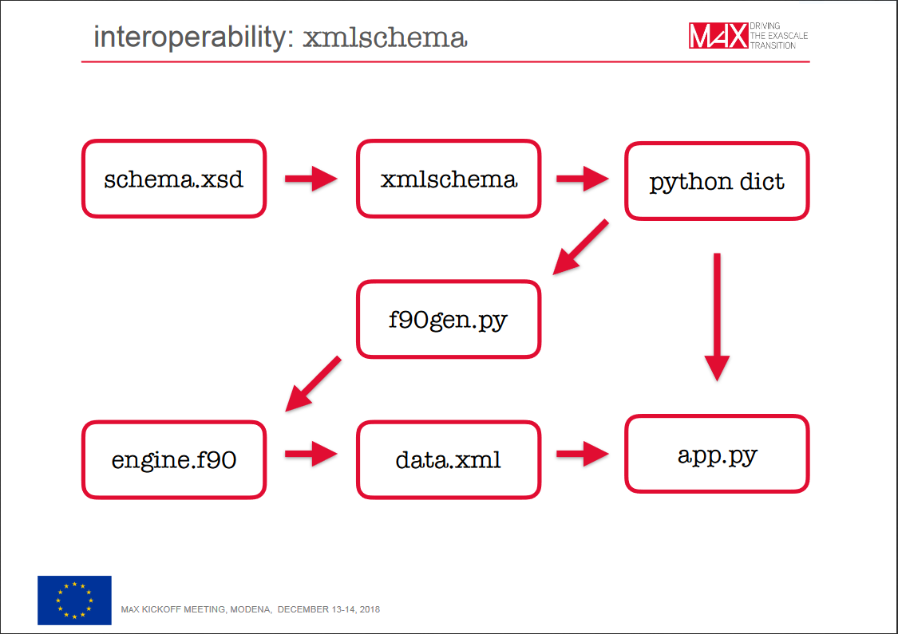

# Urgent actions to be taken for Quantum ESPRESSO
(irrespective of what MaX can and will do)

* Developers' documentation: at least a description of file formats,
  of most important variables, and of what each routine does
* Reorganization of MD routines in PWscf, merge with dynamics in CP
* More robust algorithms for self-consistency and diagonalization
* Linear-response cleanup and reorganization, improve performances and stability of the phonon code
* Complete, effective, and maintainable GPU porting
* Automatic choice/suggestion of parallelization strategy

# What can Quantum ESPRESSO provide to other groups
(in addition to what already started and mostly finished in MaX-1:
FFTXlib, LAXlib, KS_Solvers libraries for FFT, parallel linear algebra
and diagonalization, iterative diagonalization, respectively)

* Library of linear-response algorithms (especially to Yambo)
* I/O tools for reading and writing various structured (xml or hdf5) files (see next picture)
* Library of exchange-correlation functionals (van der Waals included) compatible at some level with libxc
* Library of algorithms for self-consistency (charge mixing)
* Tools for crystal and lattice generation, symmetry and symmetrization
* Algorithms for structural optimization, NEB, MD and thermostats

# A developer tool to read/write xml file from the schema

# Work currently under way or soon to be started

* Final details and cleanup of new xml/hdf5/binary I/O
* new xml files for the phonon code, preliminary to iotk removal
* change from rho up/down to rho total/up-down in LSDA. Related, to follow:
* reorganization of exchange-correlation functionals 
* cleanup of pseudopotential read/write/convert
* inclusion of exact exchange with localization
* ...
